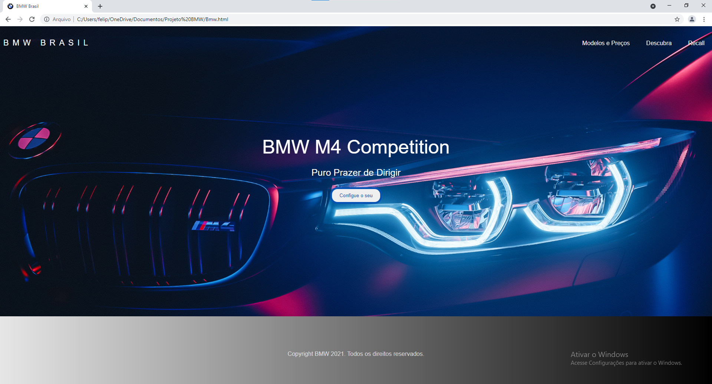

<h1 align="center">Sobre o Projeto</h1>

<h4>Meu primeiro site feito com progamação fiz para ser um teste para mim mesmo para saber meu desempenho de meu potencial</h4>

 

Esse projeto...

<a href="#sobre">Sobre</a> •
<a href="#Roadmap">Roadmap</a> •
<a href="#Tecnologias">Tecnologias</a> •
<a href="#Ferramentas">Ferramentas</a> •
<a href="#Autor">Autor</a>

 
<h4 aling="center">
   ⚠ Projeto reposisionado para MVC - Versão mais recente ⚠
  </h4>
   
   

<h1 aling="center">
   
</h1>

 

<h4 aling="center">
   ⚠ Projeto reposisionado para MVC - Versão mais recente ⚠
  </h4>

  ### 🚀 Tecnologias

  As seguintes ferramentas foram usadas na construção do projeto:

  - [x] HTML
  - [x] CSS

  #### Ferramentas

  - [**VS CODE**](https://code.visualstudio.com/)

  ### Autor
  
   Felipe Holanda de Freitas

  # Me siga

  Made with 💜 by FELIPE HOLANDA 👋🏻 [See my Linkedin](https://www.linkedin.com/in/felipe-holanda-de-freitas-3a91281a2/)
